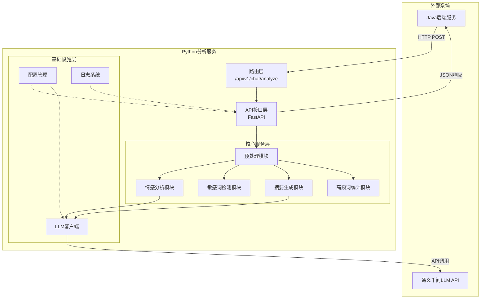
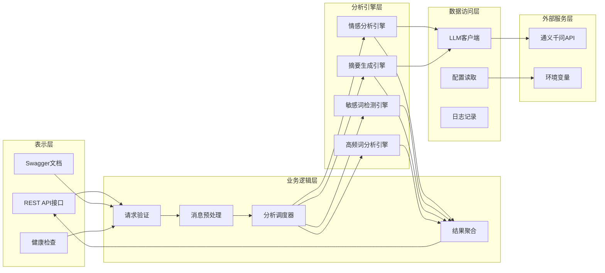
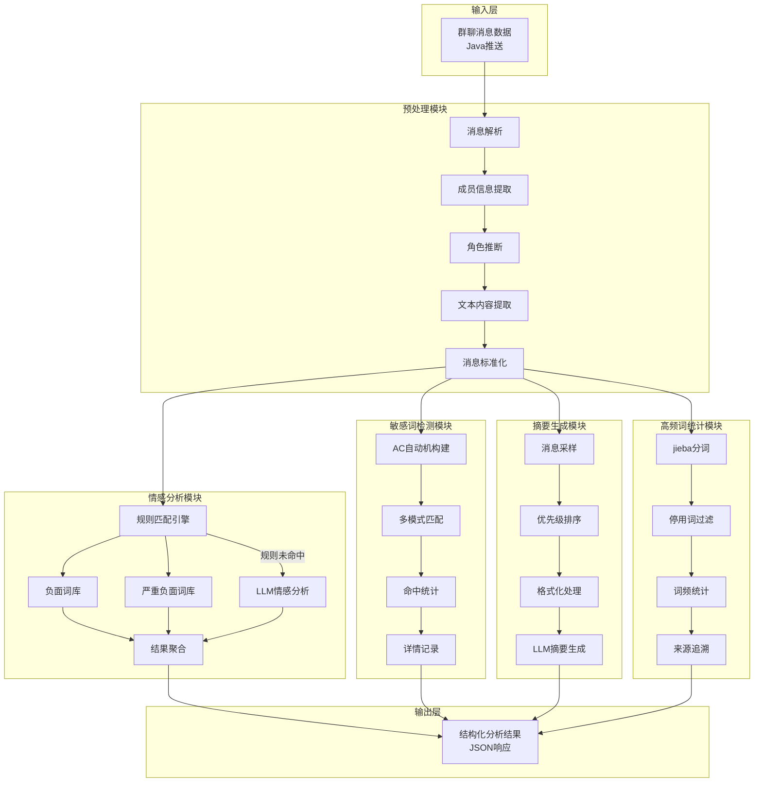
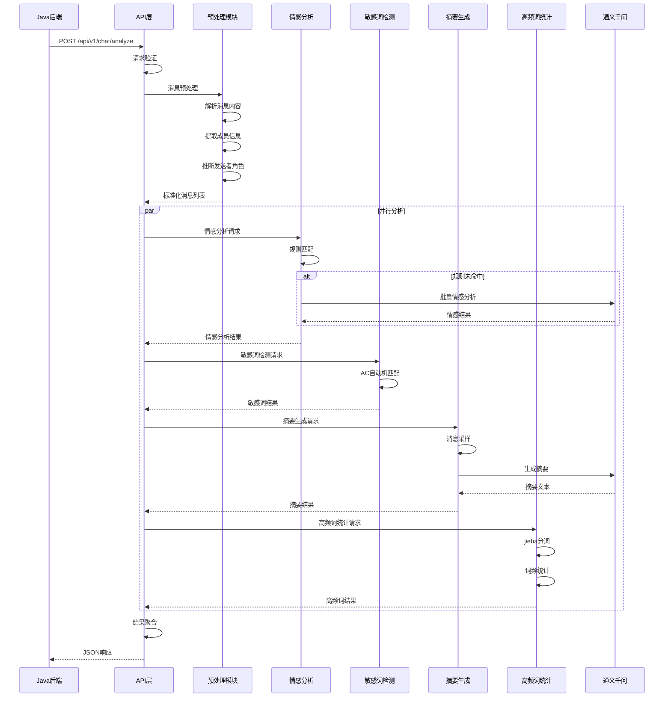
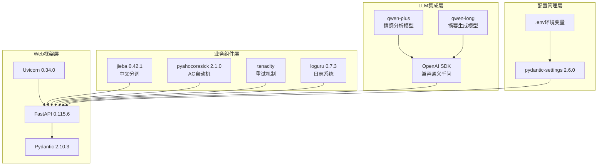
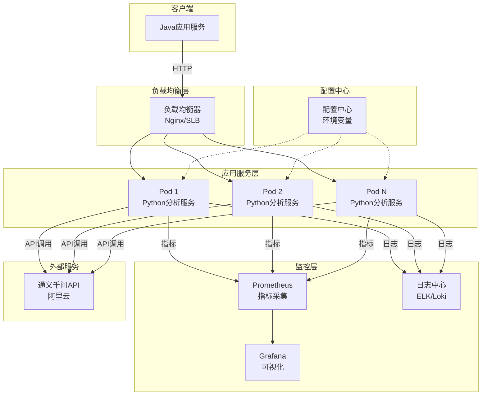
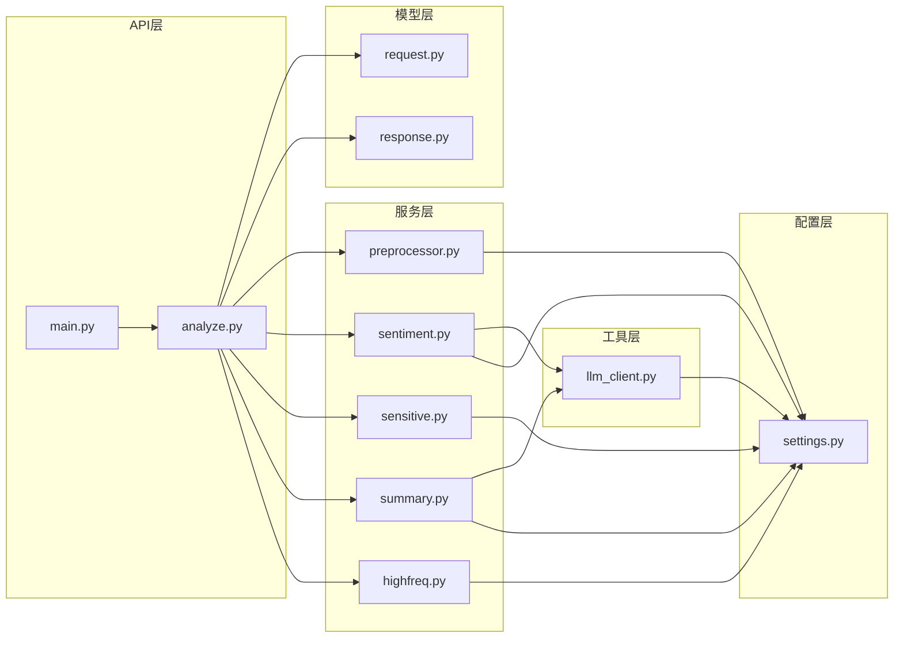
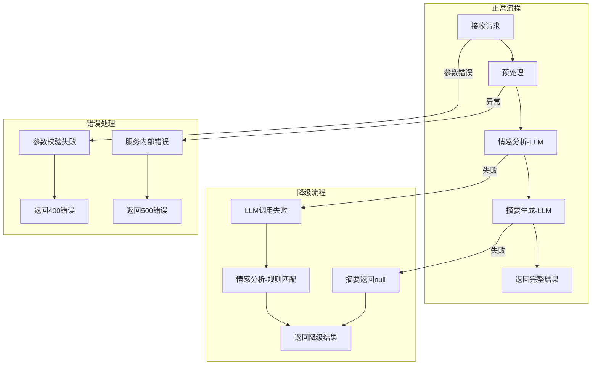
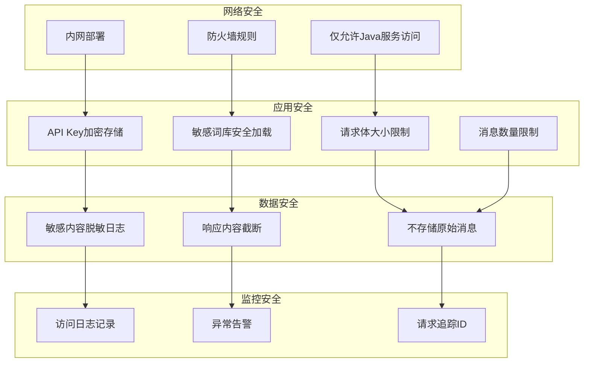
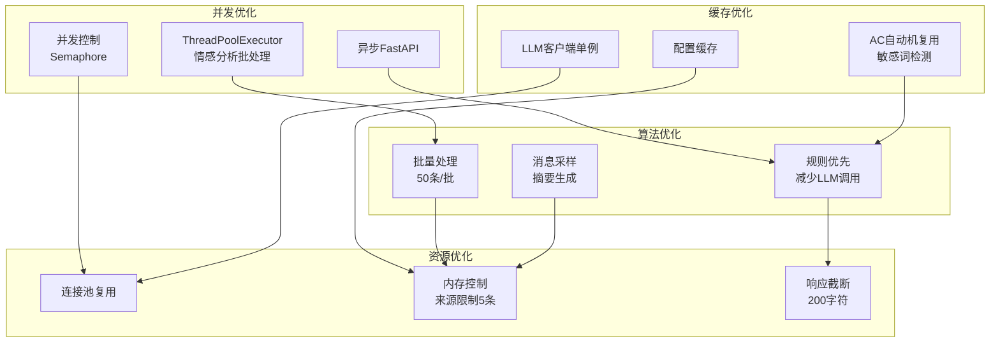

# 企业微信客户群聊智能分析系统 - 系统功能架构图

| 文档名称 | 企业微信客户群聊智能分析系统架构图 |
| :--- | :--- |
| 版本号 | V1.0 |
| 创建日期 | 2026-04-17 |
| 文档状态 | 已定稿 |

---

## 1. 系统总体架构图

---

## 2. 系统分层架构图

---

## 3. 核心功能模块架构图

---

## 4. 数据流转架构图

---

## 5. 技术组件架构图

---

## 6. 部署架构图

---

## 7. 模块依赖关系图

---

## 8. 错误处理与降级架构图

---

## 9. 安全架构图

---

## 10. 性能优化架构图

---

## 架构说明

### 核心设计原则

1. **分层架构**：API层、服务层、模型层、工具层职责清晰
2. **模块化设计**：各分析模块独立，可单独启用/禁用
3. **异步处理**：使用FastAPI异步特性提高并发性能
4. **降级策略**：LLM不可用时自动降级到规则引擎
5. **可扩展性**：支持水平扩展，无状态设计

### 关键技术点

| 技术点 | 实现方案 |
| :--- | :--- |
| 并发处理 | ThreadPoolExecutor + Semaphore |
| 敏感词匹配 | AC自动机（pyahocorasick） |
| 中文分词 | jieba + 自定义词典 |
| LLM调用 | OpenAI SDK兼容通义千问 |
| 重试机制 | tenacity指数退避 |
| 配置管理 | pydantic-settings环境变量 |

### 性能指标

| 指标 | 目标值 |
| :--- | :--- |
| 100条消息分析时间 | < 5秒 |
| 500条消息分析时间 | < 15秒 |
| 并发请求支持 | 10 req/min |
| LLM调用成功率 | > 95% |
| 服务可用性 | > 99.5% |
